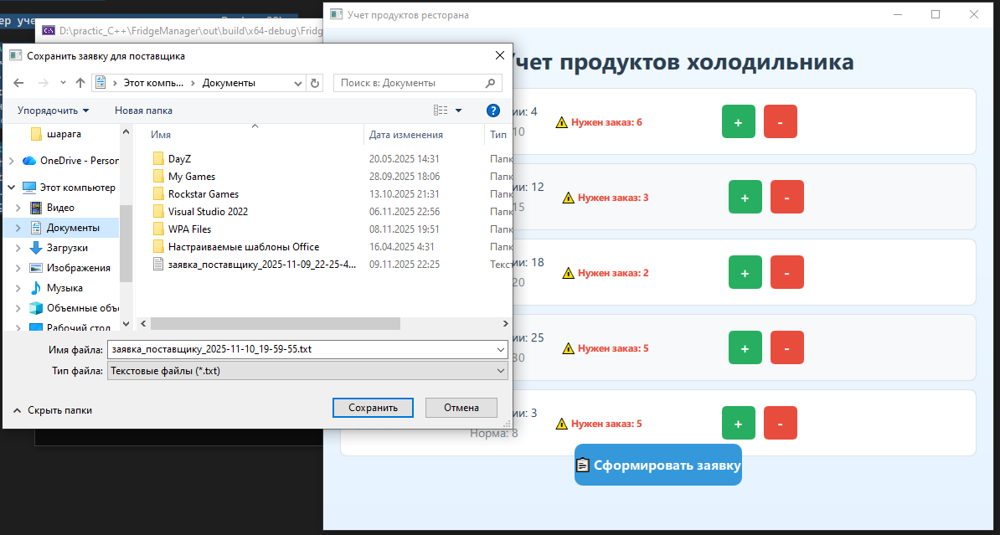
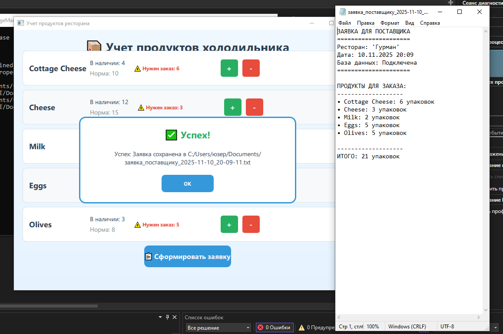

# Fridge Manager 🍽️📦
Будем вести учёт количества продуктов в холодильнике ресторана. В качестве продуктов возьмём, например: творог, сыр, молоко, яйца, оливки. Учёт будем вести упаковками. У каждого продукта есть норма наличия - то есть сколько его должно быть в холодильнике.
Должна быть возможность ввести количество упаковок какого-либо продукта, положенных в холодильник (приход) и возможность расходования выбранного продукта с указанием количества упаковок (расход).
Также должен быть интерфейс для отображения остатков продуктов в холодильнике и должна быть возможность формирования текстового файла с заявкой для поставщика - сколько упаковок какого продукта нужно заказать (количество для заказа вычисляется как норма минус количество в наличии). В заявку должны попадать только продукты, количество упаковок которых в холодильнике меньше нормы.

Менеджер учета продуктов для ресторана с PostgreSQL.

## Возможности
- 📊 Учет остатков продуктов
- ➕➖ Приход и расход продуктов  
- 📋 Формирование заявок поставщику
- 🗄️ Интеграция с PostgreSQL
- 🎨 Современный QML интерфейс

## 📸 Скриншоты работы программы
### Главное окно


### Выбор сохранения в файл


### Формирование заявки

## Сборка из исходников
```bash
mkdir build && cd build
cmake .. && make
./FridgeManager

🔧 Технические детали
Технологический стек
Язык программирования: C++17

Фреймворк GUI: Qt 6.5 + QML

База данных: PostgreSQL

Система сборки: CMake 3.16+

Пакетирование: Debian package (.deb)
